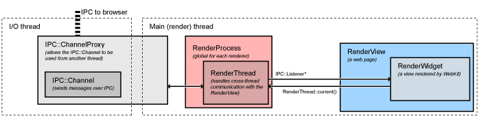

# Chromium如何显示网页（How Chromium Displays Web Pages）

[Chromium如何显示网页（How Chromium Displays Web Pages）.pdf](../_resources/Chromium如何显示网页（How%20Chromium%20Displays%20Web%20Pages）.pdf)

本文档描述了Chromium如何从底层开始显示网页。在阅读本多进程架构[multi-process architecture](https://www.chromium.org/developers/design-documents/multi-process-architecture)设计文档之前，确保您已了解主要组件的方块图。您可能还会对多进程资源加载[multi-process resource loading](https://www.chromium.org/developers/design-documents/multi-process-resource-loading)如何从网络获取页面感兴趣。

## 概念应用层

（此图的原始Google文档是http://goo.gl/MsEJX，任何@chromium.org邮箱的用户均可编辑）

每个方框代表一个概念应用层。没有任何层应该了解或依赖于任何更高级别的层。

- **WebKit**：Safari、Chromium及所有基于WebKit的浏览器共享的渲染引擎。Port是WebKit的一部分，集成了平台相关的系统服务，如资源加载和图形。
- **Glue**：将WebKit类型转换为Chromium类型。这是我们的“WebKit嵌入层”，它是Chromium和test_shell（用于测试WebKit的工具）的基础。
- **Renderer / Render Host**：这是Chromium的“多进程嵌入层”，它在进程边界上代理通知和命令。
- **WebContents**：一个可重用组件，是Content模块的主要类。它易于嵌入，允许HTML在视图中进行多进程渲染。有关更多信息，请参见Content模块页面[content module pages](https://www.chromium.org/developers/content-module)。
- **Browser**：表示浏览器窗口，它包含多个WebContents。
- **Tab Helpers**：可以通过WebContentsUserData mixin附加到WebContents的各个对象。浏览器将各种各样的Tab Helpers附加到其持有的WebContents上（一个用于收藏夹图标，一个用于信息条等）。

## WebKit

我们使用[WebKit](http://webkit.org/)开源项目来布局网页。此代码从Apple获取，存储在/third_party/WebKit目录中。WebKit主要由代表核心布局功能的“WebCore”和运行JavaScript的“JavaScriptCore”组成。我们仅在测试中运行JavaScriptCore，通常我们用高性能的V8 JavaScript引擎替代它。我们实际上并不使用Apple所谓的“WebKit”层，这是WebCore和OS X应用（如Safari）之间的嵌入API。为了方便，我们通常将来自Apple的代码统称为“WebKit”。

### WebKit Port

在最底层，我们有我们的WebKit“port”。这是我们实现的平台特定功能，与平台无关的WebCore代码接口。这些文件位于WebKit树中，通常在chromium目录或有Chromium后缀的文件中。我们port的大部分实际上不是特定于操作系统的：你可以认为它是WebCore的“Chromium port”。一些部分，如字体渲染，必须针对每个平台不同处理。

- 网络流量由我们的多进程资源加载 [multi-process resource loading](https://www.chromium.org/developers/design-documents/multi-process-resource-loading) 系统处理，而不是直接从渲染进程交给操作系统。
- 图形使用为Android开发的Skia图形库。它是一个跨平台图形库，处理所有图像和图形基本体（除了文本）。Skia位于/third_party/skia目录中。图形操作的主要入口是/webkit/port/platform/graphics/GraphicsContextSkia.cpp。它使用了同一目录中的许多其他文件以及/base/gfx中的文件。

### WebKit Glue

Chromium应用程序使用不同的类型、编码风格和代码布局与第三方WebKit代码不同。WebKit “glue” 提供了一个更方便的嵌入API，使用了Google的编码规范和类型（例如，我们使用std::string而不是WebCore::String，用GURL而不是KURL）。glue代码位于/webkit/glue目录中。glue对象通常与WebKit对象命名相似，但以“Web”开头。例如，WebCore::Frame变成WebFrame。

WebKit “glue” 层将Chromium代码库的其余部分与WebCore数据类型隔离开来，以帮助最小化WebCore更改对Chromium代码库的影响。因此，Chromium从不直接使用WebCore数据类型。当Chromium需要处理某些WebCore对象时，会向WebKit “glue” 添加API。

“test shell” 应用程序是一个简化的浏览器，用于测试我们的WebKit port和glue代码。它使用与Chromium相同的glue接口与WebKit通信。它为开发人员提供了一种更简单的方式来测试新代码，而无需许多复杂的浏览器功能、线程和进程。该应用程序还用于运行自动化的WebKit测试。然而，“test shell”的缺点是它不像Chromium那样以多进程方式使用WebKit。内容模块嵌入在一个名为“content shell”的应用程序中，它将很快代替“test shell”来运行测试。

## 渲染进程

Chromium的渲染进程使用glue接口嵌入我们的WebKit port。它本身不包含太多代码：其主要任务是充当与浏览器IPC通道的渲染器一侧。

渲染器中最重要的类是RenderView，位于/content/renderer/render_view_impl.cc中。该对象表示一个网页，处理与浏览器进程的所有导航相关命令。它继承自RenderWidget，提供绘制和输入事件处理功能。RenderView通过全局（每个渲染进程）RenderProcess对象与浏览器进程通信。

### FAQ：RenderWidget和RenderView的区别是什么？

RenderWidget通过实现glue层中的WebWidgetDelegate抽象接口映射到一个WebCore::Widget对象。这基本上是屏幕上的一个窗口，接收输入事件并进行绘制。RenderView继承自RenderWidget，是标签页或弹出窗口的内容。它除了处理widget的绘制和输入事件外，还处理导航命令。唯一一个没有RenderView的RenderWidget存在的情况是网页上的选择框。这些带有向下箭头的框弹出一个选项列表。选择框必须使用本机窗口进行渲染，以便它们可以出现在所有其他内容之上，并在必要时弹出框架。这些窗口需要绘制并接收输入，但没有单独的“网页”（RenderView）为它们提供服务。

### 渲染器中的线程

每个渲染器有两个线程（请参见多进程架构页面的图表，或Chromium中的线程编程方法[threading in Chromium](https://www.chromium.org/developers/design-documents/threading)）。渲染线程是主要对象（如RenderView和所有WebKit代码）运行的地方。当它与浏览器通信时，消息首先发送到主线程，然后由主线程将消息分派到浏览器进程。这使我们能够从渲染器同步地向浏览器发送消息。这用于少数需要浏览器结果才能继续的操作。例如，当JavaScript请求页面的cookies时，渲染器线程会阻塞，主线程会排队所有接收到的消息，直到找到正确的响应。随后接收到的所有消息都会发布到渲染器线程进行正常处理。

## 浏览器进程

### 低级浏览器进程对象

所有与渲染进程的[IPC](https://www.chromium.org/developers/design-documents/inter-process-communication)通信都在浏览器的I/O线程上完成。该线程还处理所有网络通信[network communication](https://www.chromium.org/developers/design-documents/multi-process-resource-loading)，以防止其干扰用户界面。

当在主线程（用户界面运行的地方）上初始化RenderProcessHost时，它会创建新的渲染器进程和一个带有命名管道的ChannelProxy IPC对象。该对象在浏览器的I/O线程上运行，监听与渲染器的命名管道，并自动将所有消息转发回UI线程上的RenderProcessHost。在此通道中会安装一个ResourceMessageFilter，用于过滤可以直接在I/O线程上处理的某些消息（如网络请求）。这种过滤发生在ResourceMessageFilter::OnMessageReceived中。

UI线程上的RenderProcessHost负责将所有视图特定的消息分派到适当的RenderViewHost（它自身处理少量非视图特定的消息）。这种分派发生在RenderProcessHost::OnMessageReceived中。

### 高级浏览器进程对象

视图特定的消息进入RenderViewHost::OnMessageReceived中。大多数消息在此处理，其余的消息会转发给RenderWidgetHost基类。这两个对象映射到渲染器中的RenderView和RenderWidget（见上文“渲染进程”中的定义）。每个平台都有一个视图类（RenderWidgetHostView[Aura|Gtk|Mac|Win]）来实现与本地视图系统的集成。

在RenderView/Widget之上是WebContents对象，大多数消息实际上最终成为该对象上的函数调用。WebContents表示网页的内容。它是内容模块中的顶级对象，负责在矩形视图中显示网页。有关更多信息，请参见内容模块页面[content module pages](https://www.chromium.org/developers/content-module)。

WebContents对象包含在TabContentsWrapper中。它位于chrome/目录中，负责一个标签页。

## 示例说明

有关导航和启动的更多示例，请参见浏览Chromium源码[Getting Around the Chromium Source Code](https://www.chromium.org/developers/how-tos/getting-around-the-chrome-source-code)。

### "设置光标"消息的生命周期

设置光标是一个从渲染器发送到浏览器的典型消息示例。在渲染器中，以下是发生的情况。

- 设置光标消息由WebKit内部生成，通常响应输入事件。设置光标消息在content/renderer/render_widget.cc中的RenderWidget::SetCursor中开始。
- 它会调用RenderWidget::Send来分派消息。此方法也被RenderView用于向浏览器发送消息。它会调用RenderThread::Send。
- 这会调用IPC::SyncChannel，该通道会在内部代理消息到渲染器的主线程，并将其发布到命名管道以发送到浏览器。

然后浏览器接管：

- 渲染器的I/O线程上的IPC::ChannelProxy在浏览器中接收所有消息。它首先通过ResourceMessageFilter，直接在I/O线程上分派网络请求和相关消息。由于我们的消息未被过滤掉，它继续传递到浏览器的UI线程（IPC::ChannelProxy在内部处理此操作）。
- 在content/browser/renderer_host/render_process_host_impl.cc中的RenderProcessHost::OnMessageReceived接收到相应渲染进程中所有视图的消息。它直接处理几类消息，其余的消息转发给对应的RenderViewHost。
- 消息到达content/browser/renderer_host/render_view_host_impl.cc中的RenderViewHost::OnMessageReceived。许多消息在此处理，但我们的消息没有，因为它是从RenderWidget发送并由RenderWidgetHost处理的消息。
- RenderViewHost中的所有未处理消息都会自动转发给RenderWidgetHost，包括我们设置光标的消息。
- content/browser/renderer_host/render_view_host_impl.cc中的消息映射最终在RenderWidgetHost::OnMsgSetCursor中接收消息，并调用相应的UI函数来设置鼠标光标。

### "鼠标点击"消息的生命周期

发送鼠标点击是从浏览器发送到渲染器的典型消息示例。

- Windows消息在浏览器的UI线程上由RenderWidgetHostViewWin::OnMouseEvent接收，然后在同一类中调用ForwardMouseEventToRenderer。
- 转发器函数将输入事件打包成跨平台的WebMouseEvent，并最终将其发送到它关联的RenderWidgetHost。
- RenderWidgetHost::ForwardInputEvent创建一个IPC消息ViewMsg_HandleInputEvent，将WebInputEvent序列化到其中，并调用RenderWidgetHost::Send。
- 这只是转发给拥有的RenderProcessHost::Send函数，后者将消息交给IPC::ChannelProxy。
- IPC::ChannelProxy在内部将消息代理到浏览器的I/O线程，并将其写入相应渲染器的命名管道。

注意，许多其他类型的消息是在WebContents中创建的，特别是导航消息。这些消息从WebContents到RenderViewHost的路径类似。

然后渲染器接管：

- 渲染器主线程上的IPC::Channel读取由浏览器发送的消息，IPC::ChannelProxy代理到渲染器线程。
- RenderView::OnMessageReceived接收消息。许多类型的消息直接在此处理。由于点击消息不是，它会传递给RenderWidget::OnMessageReceived，后者又将其转发给RenderWidget::OnHandleInputEvent。
- 输入事件交给WebWidgetImpl::HandleInputEvent，在那里转换为WebKit的PlatformMouseEvent类，并交给WebKit内部的WebCore::Widget类。